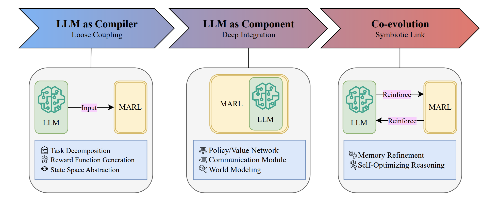

# LLM-based Multi-agent Systems Learning Paradigms Review

[](https://arxiv.org/abs/XXXX.XXXX)


A professionally curated list of resources on **LLM-based Multi-agent Systems (LLM-MAS)**, focusing on **Multi-Agent
Reinforcement Learning (MARL)**.

We chart the shift from prompt-assembled LLM teams to **learning-driven** multi-agent systems—especially **LLM + MARL**—and propose a **Hierarchy of Emergent Intelligence**, organizing system intelligence into three levels - Individual, Collaborative, and Evolutionary.


## Survey paper

[**Survey on Learning Paradigms for LLM-based Multi-Agent Systems: Toward Evolutionary Intelligence**](https://arxiv.org/abs/XXXX.XXXX)

TODO: Authors

#### If you find this repository helpful for your work, please kindly cite our survey paper.

```bibtex
TODO
```

## Table of Contents

- [Highlights](#highlights)
- [Taxonomy of LLM-MAS Systems](#taxonomy-of-llm-mas-systems)
- [Learning Paradigms](#learning-paradigms)
  - [Paradigm I: Prompting LLM-MAS](#paradigm-i-prompting-llm-mas)
  - [Paradigm II: Supervised Fine-Tuning for LLM-MAS](#paradigm-ii-supervised-fine-tuning-for-llm-mas)
  - [Paradigm III: Multi-Agent Reinforcement Learning for LLM-MAS](#paradigm-iii-multi-agent-reinforcement-learning-for-llm-mas)


## ✨ Highlights

- **Hierarchy of Emergent Intelligence.** From single-agent perception/reasoning and tool use, to collaborative roles/communication/coordination, to **evolutionary** structures with meta-reasoning and continuous co-evolution.  
- **Three Paradigms.** 
  - **Prompting** for static orchestration, 
  - **Supervised Fine-Tuning** for protocol injection and specialization, 
  - **MARL** for adaptive, reward-driven collaboration.  
- **Coupling Spectrum.** How deep LLMs and RL are intertwined — from LLMs as semantic compilers for tasks/rewards to deeply co-evolving architectures.  
- **Foundations & Benchmarks.** Unify MARL foundations (credit assignment, communication, safety/constraints, scalability) with LLM-MAS, and map benchmarks spanning math/code/multimodal/collaborative/embodied tasks.  

<br>

<p>
  
  <em> 
    Illustration of the “Hierarchy of Emergent Intelligence” in LLM systems. As capability and adaptivity increase, single LLMs evolve into agentic systems that organize roles and tools, then into multi-agent systems that coordinate through collaboration, communication, and adaptive architectures, and finally into evolutionary MAS that support structural evolution, meta-reasoning, and continuous co-evolution.
  </em>
</p>

## Taxonomy of LLM-MAS Systems
Our taxonomy includes three ascending levels of agentic complexity, each capturing a qualitatively distinct layer of reasoning, interaction, and adaptation in LLM-based systems

<p>
  
</p>


## Learning Paradigms
We examine three principal paradigms, each offering a distinct approach to engineering multiagent collaboration.

### Paradigm I: Prompting LLM-MAS
This foundational approach relies on sophisticated prompt engineering to assign agent roles, define tasks, and orchestrate communication without any updates to the underlying model weights. It serves as the baseline for constructing static, yet often highly effective, multi-agent systems.

#### Agent Roles and Collaboration Paradigms

* MetaGPT: Meta Programming for A Multi-Agent Collaborative Framework 
[\[paper\]](https://arxiv.org/abs/2308.00352)
[\[official code\]](https://github.com/FoundationAgents/MetaGPT)

* CAMEL: Communicative Agents for "Mind" Exploration of Large Language Model Society
[\[paper\]](https://arxiv.org/abs/2303.17760)
[\[official code\]](https://github.com/camel-ai/camel)

* RoCo: Dialectic Multi-Robot Collaboration with Large Language Models
[\[paper\]](https://arxiv.org/abs/2307.04738)
[\[official code\]](https://github.com/MandiZhao/robot-collab)

* Multi-Agent Collaboration: Harnessing the Power of Intelligent LLM Agents
[\[paper\]](https://arxiv.org/abs/2306.03314)

* Improving Factuality and Reasoning in Language Models through Multiagent Debate
[\[paper\]](https://arxiv.org/abs/2305.14325)
[\[official code\]](https://github.com/composable-models/llm_multiagent_debate)

* Examining Inter-Consistency of Large Language Models Collaboration: An In-depth Analysis via Debate
[\[paper\]](https://arxiv.org/abs/2305.11595)
[\[official code\]](https://github.com/Waste-Wood/FORD)

* AgentVerse: Facilitating Multi-Agent Collaboration and Exploring Emergent Behaviors 
[\[paper\]](https://arxiv.org/abs/2308.10848)
[\[official code\]](https://github.com/OpenBMB/AgentVerse)

* Social Simulacra: Creating Populated Prototypes for Social Computing Systems
[\[paper\]](https://arxiv.org/abs/2208.04024)

* Unleashing the Emergent Cognitive Synergy in Large Language Models: A Task-Solving Agent through Multi-Persona Self-Collaboration
[\[paper\]](https://arxiv.org/abs/2307.05300)
[\[official code\]](https://github.com/MikeWangWZHL/Solo-Performance-Prompting)

* Chatdev: Communicative agents for software development. 
[\[paper\]](https://arxiv.org/abs/2307.07924)
[\[official code\]](https://github.com/OpenBMB/ChatDev)

* Reflexion: Language Agents with Verbal Reinforcement Learning
[\[paper\]](https://arxiv.org/abs/2303.11366)
[\[official code\]](https://github.com/noahshinn/reflexion)

* MACRec: a Multi-Agent Collaboration Framework for Recommendation
[\[paper\]](https://arxiv.org/abs/2402.15235)
[\[official code\]](https://github.com/wzf2000/MACRec)

* ChatEval: Towards Better LLM-based Evaluators through Multi-Agent Debate
[\[paper\]](https://arxiv.org/abs/2308.07201)
[\[official code\]](https://github.com/thunlp/ChatEval)

* LLMArena: Assessing Capabilities of Large Language Models in Dynamic Multi-Agent Environments
[\[paper\]](https://arxiv.org/abs/2402.16499)
[\[official code\]](https://github.com/THU-BPM/LLMArena)

* Encouraging Divergent Thinking in Large Language Models through Multi-Agent Debate
[\[paper\]](https://arxiv.org/abs/2305.19118)
[\[official code\]](https://github.com/Skytliang/Multi-Agents-Debate)

* MetaQA: Combining Expert Agents for Multi-Skill Question Answering
[\[paper\]](https://arxiv.org/abs/2112.01922)
[\[official code\]](https://github.com/UKPLab/MetaQA)

* CompeteAI: Understanding the Competition Dynamics in Large Language Model-based Agents
[\[paper\]](https://arxiv.org/abs/2310.17512)
[\[official code\]](https://github.com/microsoft/competeai)

* Cooperation, Competition, and Maliciousness: LLM-Stakeholders Interactive Negotiation
[\[paper\]](https://arxiv.org/abs/2309.17234)
[\[official code\]](https://github.com/S-Abdelnabi/LLM-Deliberation)

* Nested Mixture of Experts: Cooperative and Competitive Learning of Hybrid Dynamical System
[\[paper\]](https://arxiv.org/abs/2011.10605)

* A Survey on Mixture of Experts in Large Language Models
[\[paper\]](https://arxiv.org/abs/2407.06204)
[\[official code\]](https://github.com/withinmiaov/A-Survey-on-Mixture-of-Experts-in-LLMs)

* Evaluating Language Model Agency through Negotiations
[\[paper\]](https://arxiv.org/abs/2401.04536)
[\[official code\]](https://github.com/epfl-dlab/LAMEN)

* Welfare Diplomacy: Benchmarking Language Model Cooperation
[\[paper\]](https://arxiv.org/abs/2310.08901)
[\[official code\]](https://github.com/mukobi/welfare-diplomacy)

* Avalon's Game of Thoughts: Battle Against Deception through Recursive Contemplation
[\[paper\]](https://arxiv.org/abs/2310.01320)
[\[official code\]](https://github.com/Shenzhi-Wang/recon)

#### Communication Protocols and Media

* AutoAgents: A Framework for Automatic Agent Generation
[\[paper\]](https://arxiv.org/abs/2309.17288)
[\[official code\]](https://github.com/Link-AGI/AutoAgents)

* AgentVerse: Facilitating Multi-Agent Collaboration and Exploring Emergent Behaviors 
[\[paper\]](https://arxiv.org/abs/2308.10848)
[\[official code\]](https://github.com/OpenBMB/AgentVerse)

* Advancing Agentic Systems: Dynamic Task Decomposition, Tool Integration and Evaluation using Novel Metrics and Dataset
[\[paper\]](https://arxiv.org/abs/2410.22457)

* MetaGPT: Meta Programming for A Multi-Agent Collaborative Framework 
[\[paper\]](https://arxiv.org/abs/2308.00352)
[\[official code\]](https://github.com/FoundationAgents/MetaGPT)

* Self-Organized Agents: A LLM Multi-Agent Framework toward Ultra Large-Scale Code Generation and Optimization
[\[paper\]](https://arxiv.org/abs/2404.02183)
[\[official code\]](https://github.com/tsukushiAI/self-organized-agent)

* LLM-Blender: Ensembling Large Language Models with Pairwise Ranking and Generative Fusion
[\[paper\]](https://arxiv.org/abs/2306.02561)
[\[official code\]](https://github.com/yuchenlin/LLM-Blender)

* Encouraging Divergent Thinking in Large Language Models through Multi-Agent Debate
[\[paper\]](https://arxiv.org/abs/2305.19118)
[\[official code\]](https://github.com/Skytliang/Multi-Agents-Debate)

* A Dynamic LLM-Powered Agent Network for Task-Oriented Agent Collaboration
[\[paper\]](https://arxiv.org/abs/2310.02170)
[\[official code\]](https://github.com/SALT-NLP/DyLAN)

* Skeleton-of-Thought: Prompting LLMs for Efficient Parallel Generation
[\[paper\]](https://arxiv.org/abs/2307.15337)
[\[official code\]](https://github.com/imagination-research/sot)

* AgentCoord: Visually Exploring Coordination Strategy for LLM-based Multi-Agent Collaboration
[\[paper\]](https://arxiv.org/abs/2404.11943)
[\[official code\]](https://github.com/AgentCoord/AgentCoord)

* AutoAct: Automatic Agent Learning from Scratch for QA via Self-Planning
[\[paper\]](https://arxiv.org/abs/2401.05268)
[\[official code\]](https://github.com/zjunlp/AutoAct)

* Meta-Prompting: Enhancing Language Models with Task-Agnostic Scaffolding
[\[paper\]](https://arxiv.org/abs/2401.12954)
[\[official code\]](https://github.com/suzgunmirac/meta-prompting)

* Examining Inter-Consistency of Large Language Models Collaboration: An In-depth Analysis via Debate
[\[paper\]](https://arxiv.org/abs/2305.11595)
[\[official code\]](https://github.com/Waste-Wood/FORD)

* Exchange-of-Thought: Enhancing Large Language Model Capabilities through Cross-Model Communication
[\[paper\]](https://arxiv.org/abs/2312.01823)
[\[official code\]](https://github.com/yinzhangyue/EoT)

* Exploring Collaboration Mechanisms for LLM Agents: A Social Psychology View
[\[paper\]](https://arxiv.org/abs/2310.02124)
[\[official code\]](https://github.com/zjunlp/MachineSoM)

* Agents meet OKR: An Object and Key Results Driven Agent System with Hierarchical Self-Collaboration and Self-Evaluation
[\[paper\]](https://arxiv.org/abs/2311.16542)
[\[official code\]](https://okr-agent.github.io/)

* Improving Factuality and Reasoning in Language Models through Multiagent Debate
[\[paper\]](https://arxiv.org/abs/2305.14325)
[\[official code\]](https://github.com/composable-models/llm_multiagent_debate)

* API-Bank: A Comprehensive Benchmark for Tool-Augmented LLMs
[\[paper\]](https://aclanthology.org/2023.emnlp-main.187/)
[\[official code\]](https://github.com/AlibabaResearch/DAMO-ConvAI/tree/main/api-bank)

* CAMEL: Communicative Agents for "Mind" Exploration of Large Language Model Society
[\[paper\]](https://arxiv.org/abs/2303.17760)
[\[official code\]](https://github.com/camel-ai/camel)

* Unleashing the Emergent Cognitive Synergy in Large Language Models: A Task-Solving Agent through Multi-Persona Self-Collaboration
[\[paper\]](https://arxiv.org/abs/2307.05300)
[\[official code\]](https://github.com/MikeWangWZHL/Solo-Performance-Prompting)

* ChatEval: Towards Better LLM-based Evaluators through Multi-Agent Debate
[\[paper\]](https://arxiv.org/abs/2308.07201)
[\[official code\]](https://github.com/thunlp/ChatEval)

* GAIA: a benchmark for General AI Assistants
[\[paper\]](https://arxiv.org/abs/2311.12983)
[\[official code\]](https://huggingface.co/gaia-benchmark)

* Multi-Agent Consensus Seeking via Large Language Models
[\[paper\]](https://arxiv.org/abs/2310.20151)
[\[official code\]](https://github.com/WindyLab/ConsensusLLM-code)

* Towards Reasoning in Large Language Models via Multi-Agent Peer Review Collaboration
[\[paper\]](https://arxiv.org/abs/2311.08152)
[\[official code\]](https://github.com/HITsz-TMG/Multi-agent-peer-review)

* RoCo: Dialectic Multi-Robot Collaboration with Large Language Models
[\[paper\]](https://arxiv.org/abs/2307.04738)
[\[official code\]](https://github.com/MandiZhao/robot-collab)

* Multi-Agent Collaboration: Harnessing the Power of Intelligent LLM Agents
[\[paper\]](https://arxiv.org/abs/2306.03314)

* Enhancing human-AI collaboration through logic-guided reasoning.
[\[paper\]](https://proceedings.iclr.cc/paper_files/paper/2024/file/81b8390039b7302c909cb769f8b6cd93-Paper-Conference.pdf)

* Theory of Mind for Multi-Agent Collaboration via Large Language Models
[\[paper\]](https://arxiv.org/abs/2310.10701)
[\[official code\]](https://github.com/romanlee6/multi_LLM_comm)

* Runtime verification of self-adaptive multi-agent system using probabilistic timed automata
[\[paper\]](https://journals.sagepub.com/doi/abs/10.3233/JIFS-232397)

* MAgIC: Investigation of Large Language Model Powered Multi-Agent in Cognition, Adaptability, Rationality and Collaboration
[\[paper\]](https://arxiv.org/abs/2311.08562)
[\[official code\]](https://github.com/cathyxl/MAgIC)


#### System Architectures and Interaction Patterns

* MetaGPT: Meta Programming for A Multi-Agent Collaborative Framework 
[\[paper\]](https://arxiv.org/abs/2308.00352)
[\[official code\]](https://github.com/FoundationAgents/MetaGPT)

* Chatdev: Communicative agents for software development. 
[\[paper\]](https://arxiv.org/abs/2307.07924)
[\[official code\]](https://github.com/OpenBMB/ChatDev)

* MapCoder: Multi-Agent Code Generation for Competitive Problem Solving
[\[paper\]](https://arxiv.org/abs/2405.11403)
[\[official code\]](https://github.com/Md-Ashraful-Pramanik/MapCoder)

* MACRec: a Multi-Agent Collaboration Framework for Recommendation
[\[paper\]](https://arxiv.org/abs/2402.15235)
[\[official code\]](https://github.com/wzf2000/MACRec)

* LLM-Blender: Ensembling Large Language Models with Pairwise Ranking and Generative Fusion
[\[paper\]](https://arxiv.org/abs/2306.02561)
[\[official code\]](https://github.com/yuchenlin/LLM-Blender)

* Towards Reasoning in Large Language Models via Multi-Agent Peer Review Collaboration
[\[paper\]](https://arxiv.org/abs/2311.08152)
[\[official code\]](https://github.com/HITsz-TMG/Multi-agent-peer-review)

* ChatEval: Towards Better LLM-based Evaluators through Multi-Agent Debate
[\[paper\]](https://arxiv.org/abs/2308.07201)
[\[official code\]](https://github.com/thunlp/ChatEval)

* Improving Factuality and Reasoning in Language Models through Multiagent Debate
[\[paper\]](https://arxiv.org/abs/2305.14325)
[\[official code\]](https://github.com/composable-models/llm_multiagent_debate)

* LEGO: A Multi-agent Collaborative Framework with Role-playing and Iterative Feedback for Causality Explanation Generation
[\[paper\]](https://aclanthology.org/2023.findings-emnlp.613/)

* CAMEL: Communicative Agents for "Mind" Exploration of Large Language Model Society
[\[paper\]](https://arxiv.org/abs/2303.17760)
[\[official code\]](https://github.com/camel-ai/camel)

* A Dynamic LLM-Powered Agent Network for Task-Oriented Agent Collaboration
[\[paper\]](https://arxiv.org/abs/2310.02170)
[\[official code\]](https://github.com/SALT-NLP/DyLAN)

* AgentVerse: Facilitating Multi-Agent Collaboration and Exploring Emergent Behaviors 
[\[paper\]](https://arxiv.org/abs/2308.10848)
[\[official code\]](https://github.com/OpenBMB/AgentVerse)

* AutoAgents: A Framework for Automatic Agent Generation
[\[paper\]](https://arxiv.org/abs/2309.17288)
[\[official code\]](https://github.com/Link-AGI/AutoAgents)

* Advancing Agentic Systems: Dynamic Task Decomposition, Tool Integration and Evaluation using Novel Metrics and Dataset
[\[paper\]](https://arxiv.org/abs/2410.22457)

* Unleashing the Emergent Cognitive Synergy in Large Language Models: A Task-Solving Agent through Multi-Persona Self-Collaboration
[\[paper\]](https://arxiv.org/abs/2307.05300)
[\[official code\]](https://github.com/MikeWangWZHL/Solo-Performance-Prompting)


#### Execution Strategies and Tool Use

* OpenAgents: An Open Platform for Language Agents in the Wild
[\[paper\]](https://arxiv.org/abs/2310.10634)
[\[official code\]](https://github.com/xlang-ai/OpenAgents)

* Chatdev: Communicative agents for software development. 
[\[paper\]](https://arxiv.org/abs/2307.07924)
[\[official code\]](https://github.com/OpenBMB/ChatDev)

* SWE-agent: Agent-Computer Interfaces Enable Automated Software Engineering
[\[paper\]](https://arxiv.org/abs/2405.15793)
[\[official code\]](https://swe-agent.com/latest/)

* ReAct: Synergizing Reasoning and Acting in Language Models
[\[paper\]](https://arxiv.org/abs/2210.03629)
[\[official code\]](https://github.com/ysymyth/ReAct)

* GAIA: a benchmark for General AI Assistants
[\[paper\]](https://arxiv.org/abs/2311.12983)
[\[official code\]](https://huggingface.co/gaia-benchmark)

* ProAgent: Building Proactive Cooperative Agents with Large Language Models
[\[paper\]](https://arxiv.org/abs/2308.11339)
[\[official code\]](https://github.com/PKU-Alignment/ProAgent)


#### Adaptation and Evolution Mechanisms

* Reflexion: Language Agents with Verbal Reinforcement Learning
[\[paper\]](https://arxiv.org/abs/2303.11366)
[\[official code\]](https://github.com/noahshinn/reflexion)

* GAIA: a benchmark for General AI Assistants
[\[paper\]](https://arxiv.org/abs/2311.12983)
[\[official code\]](https://huggingface.co/gaia-benchmark)

* A Dynamic LLM-Powered Agent Network for Task-Oriented Agent Collaboration
[\[paper\]](https://arxiv.org/abs/2310.02170)
[\[official code\]](https://github.com/SALT-NLP/DyLAN)

* ProAgent: Building Proactive Cooperative Agents with Large Language Models
[\[paper\]](https://arxiv.org/abs/2308.11339)
[\[official code\]](https://github.com/PKU-Alignment/ProAgent)

* AgentVerse: Facilitating Multi-Agent Collaboration and Exploring Emergent Behaviors 
[\[paper\]](https://arxiv.org/abs/2308.10848)
[\[official code\]](https://github.com/OpenBMB/AgentVerse)

* CAMEL: Communicative Agents for "Mind" Exploration of Large Language Model Society
[\[paper\]](https://arxiv.org/abs/2303.17760)
[\[official code\]](https://github.com/camel-ai/camel)

* MetaAgents: Large Language Model Based Agents for Decision-Making on Teaming
[\[paper\]](https://arxiv.org/abs/2310.06500)


### Paradigm II: Supervised Fine-Tuning for LLM-MAS
As the first tier of the learning paradigm, SFT enhances agent capabilities by fine-tuning the base LLM on curated datasets of expert behavior. This approach is instrumental for injecting domain-specific knowledge, enforcing desired interaction protocols, or imitating complex behavioral patterns

<p>
  
</p>

#### A Spectrum of Supervised Coupling
Supervised signals couple to LLM-based multi-agent systems at different depths of the control loop. We use supervised
coupling to describe both the provenance of targets and their binding site in the policy

 - LLM as Demonstration Learner

    * Enhancing Large Vision Language Models with Self-Training on Image Comprehension
    [\[paper\]](https://arxiv.org/abs/2405.19716)
    [\[official code\]](https://github.com/yihedeng9/STIC)

    * V-STaR: Training Verifiers for Self-Taught Reasoners
    [\[paper\]](https://arxiv.org/abs/2402.06457)
    [\[official code\]](https://github.com/AAVSO/VStar)

    * AdaSTaR: Adaptive Data Sampling for Training Self-Taught Reasoners
    [\[paper\]](https://arxiv.org/abs/2505.16322)

    * Quiet-STaR: Language Models Can Teach Themselves to Think Before Speaking
    [\[paper\]](https://arxiv.org/abs/2403.09629)
    [\[official code\]](https://github.com/ezelikman/quiet-star)

    * STaR: Bootstrapping Reasoning With Reasoning
    [\[paper\]](https://arxiv.org/abs/2203.14465)
    [\[official code\]](https://github.com/ezelikman/STaR)

    * SiriuS: Self-improving Multi-agent Systems via Bootstrapped Reasoning
    [\[paper\]](https://arxiv.org/abs/2502.04780)
    [\[official code\]](https://github.com/zou-group/sirius)


 -  LLM as Coordinator via Instruction Tuning

    * WebRL: Training LLM Web Agents via Self-Evolving Online Curriculum Reinforcement Learning
    [\[paper\]](https://arxiv.org/abs/2411.02337)
    [\[official code\]](https://github.com/THUDM/WebRL)

    * DYSTIL: Dynamic Strategy Induction with Large Language Models for Reinforcement Learning
    [\[paper\]](https://arxiv.org/abs/2505.03209)

    * UI-Genie: A Self-Improving Approach for Iteratively Boosting MLLM-based Mobile GUI Agents
    [\[paper\]](https://arxiv.org/abs/2505.21496)
    [\[official code\]](https://github.com/Euphoria16/UI-Genie)


 -  LLM with Feedback Distillation

    * Self-evolving Agents with reflective and memory-augmented abilities
    [\[paper\]](https://arxiv.org/abs/2409.00872)
    [\[official code\]](https://github.com/codepassionor/sage)

    * SELF: Self-Evolution with Language Feedback
    [\[paper\]](https://arxiv.org/abs/2310.00533)

    * Enhancing Large Vision Language Models with Self-Training on Image Comprehension
    [\[paper\]](https://arxiv.org/abs/2405.19716)
    [\[official code\]](https://github.com/yihedeng9/STIC)

    * V-STaR: Training Verifiers for Self-Taught Reasoners
    [\[paper\]](https://arxiv.org/abs/2402.06457)
    [\[official code\]](https://github.com/AAVSO/VStar)

    * AdaSTaR: Adaptive Data Sampling for Training Self-Taught Reasoners
    [\[paper\]](https://arxiv.org/abs/2505.16322)

#### Language Grounding & Task Specification

* SELF: Self-Evolution with Language Feedback
[\[paper\]](https://arxiv.org/abs/2310.00533)

* Quiet-STaR: Language Models Can Teach Themselves to Think Before Speaking
[\[paper\]](https://arxiv.org/abs/2403.09629)
[\[official code\]](https://github.com/ezelikman/quiet-star)

* STaR: Bootstrapping Reasoning With Reasoning
[\[paper\]](https://arxiv.org/abs/2203.14465)
[\[official code\]](https://github.com/ezelikman/STaR)

#### Communication, Coordination & Role Allocation

* SiriuS: Self-improving Multi-agent Systems via Bootstrapped Reasoning
[\[paper\]](https://arxiv.org/abs/2502.04780)
[\[official code\]](https://github.com/zou-group/sirius)

* Agent Workflow Memory
[\[paper\]](https://arxiv.org/abs/2409.07429)
[\[official code\]](https://github.com/zorazrw/agent-workflow-memory)

* UI-Genie: A Self-Improving Approach for Iteratively Boosting MLLM-based Mobile GUI Agents
[\[paper\]](https://arxiv.org/abs/2505.21496)
[\[official code\]](https://github.com/Euphoria16/UI-Genie)

#### Feedback Distillation, Credit Assignment & Meta-Reasoning

* Enhancing Large Vision Language Models with Self-Training on Image Comprehension
[\[paper\]](https://arxiv.org/abs/2405.19716)
[\[official code\]](https://github.com/yihedeng9/STIC)

* V-STaR: Training Verifiers for Self-Taught Reasoners
[\[paper\]](https://arxiv.org/abs/2402.06457)
[\[official code\]](https://github.com/AAVSO/VStar)

* AdaSTaR: Adaptive Data Sampling for Training Self-Taught Reasoners
[\[paper\]](https://arxiv.org/abs/2505.16322)

* SELF: Self-Evolution with Language Feedback
[\[paper\]](https://arxiv.org/abs/2310.00533)

* Quiet-STaR: Language Models Can Teach Themselves to Think Before Speaking
[\[paper\]](https://arxiv.org/abs/2403.09629)
[\[official code\]](https://github.com/ezelikman/quiet-star)

* STaR: Bootstrapping Reasoning With Reasoning
[\[paper\]](https://arxiv.org/abs/2203.14465)
[\[official code\]](https://github.com/ezelikman/STaR)

#### Safety, Fairness & Constraint Satisfaction

* V-STaR: Training Verifiers for Self-Taught Reasoners
[\[paper\]](https://arxiv.org/abs/2402.06457)
[\[official code\]](https://github.com/AAVSO/VStar)

* AdaSTaR: Adaptive Data Sampling for Training Self-Taught Reasoners
[\[paper\]](https://arxiv.org/abs/2505.16322)

* Self-Refine: Iterative Refinement with Self-Feedback
[\[paper\]](https://arxiv.org/abs/2303.17651)
[\[official code\]](https://github.com/madaan/self-refine)

* Reflexion: Language Agents with Verbal Reinforcement Learning
[\[paper\]](https://arxiv.org/abs/2303.11366)
[\[official code\]](https://github.com/noahshinn/reflexion)

#### Scalability, Generalisation & Heterogeneity

* WebRL: Training LLM Web Agents via Self-Evolving Online Curriculum Reinforcement Learning
[\[paper\]](https://arxiv.org/abs/2411.02337)
[\[official code\]](https://github.com/THUDM/WebRL)

* DYSTIL: Dynamic Strategy Induction with Large Language Models for Reinforcement Learning
[\[paper\]](https://arxiv.org/abs/2505.03209)

* UI-Genie: A Self-Improving Approach for Iteratively Boosting MLLM-based Mobile GUI Agents
[\[paper\]](https://arxiv.org/abs/2505.21496)
[\[official code\]](https://github.com/Euphoria16/UI-Genie)


### Paradigm III: Multi-Agent Reinforcement Learning for LLM-MAS
Representing the most advanced learning paradigm, MARL enables agents to learn directly from environmental interaction and feedback. It is indispensable for creating truly adaptive systems that can autonomously discover and optimize complex, long-term strategies in dynamic environments. 

#### A Spectrum of Learning-Reasoning Coupling
While subsequent sections will detail the functional roles of LLMs in MARL (e.g., for reward engineering, communication),
it is crucial to first establish a framework for understanding how the symbolic reasoning capabilities of LLMs and
the decision-making processes of MARL are integrated. We propose analyzing this integration across a spectrum of
learning-reasoning coupling.

<p>
  
</p>

#### Language Grounding & Task Specification

* YOLO-MARL: You Only LLM Once for Multi-Agent Reinforcement Learning
[\[paper\]](https://arxiv.org/abs/2410.03997)
[\[official code\]](https://github.com/paulzyzy/YOLO-MARL)

* Enhancing Multi-Agent Systems via Reinforcement Learning with LLM-based Planner and Graph-based Policy
[\[paper\]](https://arxiv.org/abs/2503.10049)

* LAMARL: LLM-Aided Multi-Agent Reinforcement Learning for Cooperative Policy Generation
[\[paper\]](https://arxiv.org/pdf/2506.01538)

* ReSo: A Reward-driven Self-organizing LLM-based Multi-Agent System for Reasoning Tasks
[\[paper\]](https://arxiv.org/abs/2503.02390)
[\[official code\]](https://github.com/hengzzzhou/ReSo)

* Self-Aware Intelligent Medical Rescue Unmanned Team via Large Language Model and Multi-Agent Reinforcement Learning
[\[paper\]](https://dl.acm.org/doi/10.1145/3744103.3744144)

* MARFT: Multi-Agent Reinforcement Fine-Tuning
[\[paper\]](https://arxiv.org/abs/2504.16129)
[\[official code\]](https://github.com/jwliao-ai/MARFT)

* MAS-GPT: Training LLMs to Build LLM-based Multi-Agent Systems
[\[paper\]](https://arxiv.org/abs/2503.03686)
[\[official code\]](https://github.com/MASWorks/MAS-GPT)

#### Communication Protocols & Knowledge Sharing

* Verco: Learning Coordinated Verbal Communication for Multi-agent Reinforcement Learning
[\[paper\]](https://arxiv.org/abs/2404.17780)

* Towards Communication Efficient Multi-Agent Cooperations: Reinforcement Learning and LLM
[\[paper\]](https://www.techrxiv.org/users/878096/articles/1259644-towards-communication-efficient-multi-agent-cooperations-reinforcement-learning-and-llm)

* FinCon: A Synthesized LLM Multi-Agent System with Conceptual Verbal Reinforcement for Enhanced Financial Decision Making
[\[paper\]](https://arxiv.org/html/2407.06567v3)
[\[official code\]](https://github.com/MXGao-A/FAgent)

* Advancing Language Multi-Agent Learning with Credit Re-Assignment for Interactive Environment Generalization
[\[paper\]](https://arxiv.org/abs/2502.14496)
[\[official code\]](https://github.com/THUNLP-MT/CollabUIAgents)

* QLLM: Do We Really Need a Mixing Network for Credit Assignment in Multi-Agent Reinforcement Learning?
[\[paper\]](https://arxiv.org/abs/2504.12961)

#### Coordination, Planning & Role Allocation

* ReMA: Learning to Meta-think for LLMs with Multi-Agent Reinforcement Learning
[\[paper\]](https://arxiv.org/abs/2503.09501)
[\[official code\]](https://github.com/ziyuwan/ReMA-public)

* JoyAgents-R1: Joint Evolution Dynamics for Versatile Multi-LLM Agents with Reinforcement Learning
[\[paper\]](https://arxiv.org/abs/2506.19846)

* Co-Learning: Code Learning for Multi-Agent Reinforcement Collaborative Framework with Conversational Natural Language Interfaces
[\[paper\]](https://arxiv.org/abs/2409.00985)
[\[official code\]](https://github.com/yuqian2003/Co_Learning)

* ML-Agent: Reinforcing LLM Agents for Autonomous Machine Learning Engineering
[\[paper\]](https://arxiv.org/abs/2505.23723)
[\[official code\]](https://github.com/MASWorks/ML-Agent)

* AGILE: A Novel Reinforcement Learning Framework of LLM Agents
[\[paper\]](https://arxiv.org/abs/2405.14751)
[\[official code\]](https://github.com/bytarnish/AGILE)

* Large Language Model-based Human-Agent Collaboration for Complex Task Solving
[\[paper\]](https://arxiv.org/abs/2402.12914)
[\[official code\]](https://github.com/XueyangFeng/ReHAC)

* MAS-GPT: Training LLMs to Build LLM-based Multi-Agent Systems
[\[paper\]](https://arxiv.org/abs/2503.03686)
[\[official code\]](https://github.com/MASWorks/MAS-GPT)

#### Reward Shaping & Credit Assignment

* LERO: LLM-driven Evolutionary framework with Hybrid Rewards and Enhanced Observation for Multi-Agent Reinforcement Learning
[\[paper\]](https://arxiv.org/abs/2503.21807)

* QLLM: Do We Really Need a Mixing Network for Credit Assignment in Multi-Agent Reinforcement Learning?
[\[paper\]](https://arxiv.org/abs/2504.12961)

* Multi-Agent Reinforcement Learning in Non-Cooperative Stochastic Games Using Large Language Models
[\[paper\]](https://ieeexplore.ieee.org/document/10793123)

* Speaking the Language of Teamwork: LLM-Guided Credit Assignment in Multi-Agent Reinforcement Learning
[\[paper\]](https://arxiv.org/abs/2502.03723)

* M3HF: Multi-agent Reinforcement Learning from Multi-phase Human Feedback of Mixed Quality
[\[paper\]](https://arxiv.org/abs/2503.02077)

* Multi-Agent Reinforcement Learning from Human Feedback: Data Coverage and Algorithmic Techniques
[\[paper\]](https://arxiv.org/abs/2503.03686)

* MAPoRL: Multi-Agent Post-Co-Training for Collaborative Large Language Models with Reinforcement Learning
[\[paper\]](https://arxiv.org/abs/2502.18439)
[\[official code\]](https://github.com/chanwoo-park-official/MAPoRL)

* Language-Driven Policy Distillation for Cooperative Driving in Multi-Agent Reinforcement Learning
[\[paper\]](https://arxiv.org/abs/2410.24152)

* Discriminative Policy Optimization for Token-Level Reward Models
[\[paper\]](https://arxiv.org/abs/2505.23363)
[\[official code\]](https://github.com/homzer/Q-RM)

* Safe Multi-agent Reinforcement Learning with Natural Language Constraints
[\[paper\]](https://arxiv.org/abs/2405.20018)

* FairMarket-RL: LLM-Guided Fairness Shaping for Multi-Agent Reinforcement Learning in Peer-to-Peer Markets
[\[paper\]](https://arxiv.org/abs/2506.22708)

* Towards Communication Efficient Multi-Agent Cooperations: Reinforcement Learning and LLM
[\[paper\]](https://www.techrxiv.org/users/878096/articles/1259644-towards-communication-efficient-multi-agent-cooperations-reinforcement-learning-and-llm)

#### Meta-Reasoning & Introspection Loops

* ReMA: Learning to Meta-think for LLMs with Multi-Agent Reinforcement Learning
[\[paper\]](https://arxiv.org/abs/2503.09501)
[\[official code\]](https://github.com/ziyuwan/ReMA-public)

* MAPoRL: Multi-Agent Post-Co-Training for Collaborative Large Language Models with Reinforcement Learning
[\[paper\]](https://arxiv.org/abs/2502.18439)
[\[official code\]](https://github.com/chanwoo-park-official/MAPoRL)

* JoyAgents-R1: Joint Evolution Dynamics for Versatile Multi-LLM Agents with Reinforcement Learning
[\[paper\]](https://arxiv.org/abs/2506.19846)

* AGILE: A Novel Reinforcement Learning Framework of LLM Agents
[\[paper\]](https://arxiv.org/abs/2405.14751)
[\[official code\]](https://github.com/bytarnish/AGILE)

* Large Language Model-based Human-Agent Collaboration for Complex Task Solving
[\[paper\]](https://arxiv.org/abs/2402.12914)
[\[official code\]](https://github.com/XueyangFeng/ReHAC)

* Meta-Thinking in LLMs via Multi-Agent Reinforcement Learning: A Survey
[\[paper\]](https://arxiv.org/abs/2504.14520)

#### Safety, Fairness & Constraint Satisfaction

* Safe Multi-agent Reinforcement Learning with Natural Language Constraints
[\[paper\]](https://arxiv.org/abs/2405.20018)

* Language-Driven Policy Distillation for Cooperative Driving in Multi-Agent Reinforcement Learning
[\[paper\]](https://arxiv.org/abs/2410.24152)

* FairMarket-RL: LLM-Guided Fairness Shaping for Multi-Agent Reinforcement Learning in Peer-to-Peer Markets
[\[paper\]](https://arxiv.org/abs/2506.22708)

* Towards Communication Efficient Multi-Agent Cooperations: Reinforcement Learning and LLM
[\[paper\]](https://www.techrxiv.org/users/878096/articles/1259644-towards-communication-efficient-multi-agent-cooperations-reinforcement-learning-and-llm)

* MARFT: Multi-Agent Reinforcement Fine-Tuning
[\[paper\]](https://arxiv.org/abs/2504.16129)
[\[official code\]](https://github.com/jwliao-ai/MARFT)

#### Scalability, Generalization & Heterogeneity

* Heterogeneous Group-Based Reinforcement Learning for LLM-based Multi-Agent Systems
[\[paper\]](https://arxiv.org/abs/2506.02718)

* Enhancing LLM QoS Through Cloud-Edge Collaboration: A Diffusion-Based Multi-Agent Reinforcement Learning Approach
[\[paper\]](https://ieeexplore.ieee.org/document/10970093)

* MARFT: Multi-Agent Reinforcement Fine-Tuning
[\[paper\]](https://arxiv.org/abs/2504.16129)
[\[official code\]](https://github.com/jwliao-ai/MARFT)

* MAS-GPT: Training LLMs to Build LLM-based Multi-Agent Systems
[\[paper\]](https://arxiv.org/abs/2503.03686)
[\[official code\]](https://github.com/MASWorks/MAS-GPT)

* Scalable UAV Multi-Hop Networking via Multi-Agent Reinforcement Learning with Large Language Models
[\[paper\]](https://arxiv.org/abs/2505.08448)

* ML-Agent: Reinforcing LLM Agents for Autonomous Machine Learning Engineering
[\[paper\]](https://arxiv.org/abs/2505.23723)
[\[official code\]](https://github.com/MASWorks/ML-Agent)
